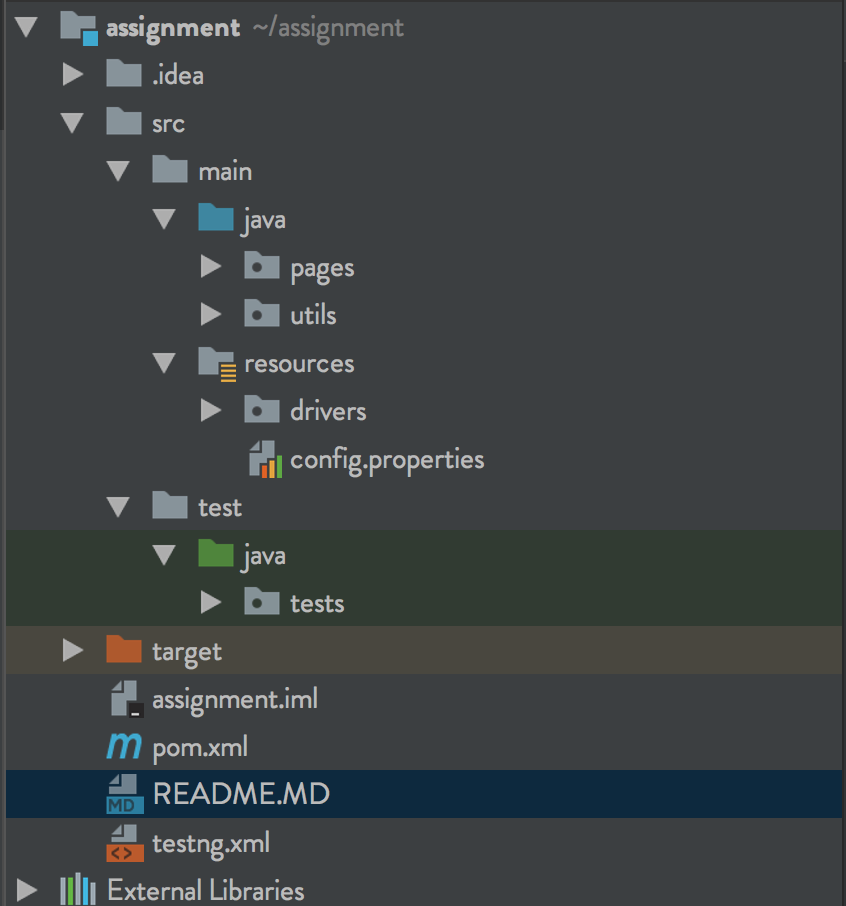

# Twitter

This project has test to verify, following a specific user on twitter. The project is in Page Object Pattern Framework. It is written in Java, using selenium.

## Getting Started

To get started install the required software and run the test to verify.

### Prerequisites

Install the below prerequisites

```
- Java v1.8
- Maven (Preferably v3.5.2) 
- Any IDE(Preferably IntelliJ)
- Chrome browser(Preferably v66)
```

## Running the tests

To run the tests use any of the two ways mentioned below.
```Add USERNAME and PASSWORD in src/main/resources/config.properties```
- Running using maven
    - Open the project in terminal and run below command
    ```$ mvn clean test``` 
- Running testng.xml through IDE  
    - Import the project to IntelliJIdea/any IDE, Build the project. Right click on testng.xml and select run.

## Project Folder Structure



### src
- src is the root folder which consists of Main folder and test folder
    #### main
    - Main has Java which consists of the java related files supporting the frame Work. It has Pages and utils folders.
        ##### Pages
        - Pages consists of the pages to support the framework. Pages contain objects and methods for a particular page.
        ##### Utils
        - This folder consists all the utilities required for the framework.
        ###### Fetching configuration from config properties file and creating constant variables. 
        - config.properties file in resources consists of configuration properties and test data for project.
        - Configutil class will fetch the properties file. 
        - Config class will convert all the properties in config to static final variables 
        ###### Driver Factory
        - The Driver factory class will create a driver required for the test`
        ###### WebElementUtils
        - This class consists of the utilities used by webdriver extracted.
    #### test
    - This folder consists of tests inside ```Java->tests```
    #### resources
    - This folder consists of resources required for the project.
        ##### drivers
        - Consists of chrome and gecko driver for running the tests.
        ##### config.properties
        - This file consists of properties and test data.
        - Please add user name and password.
        
## FollowProfileTest
- setUp Method
    - This method will open twitter and logs in user.
- verifyFollowingProfileTest
    - This will search with the given tag and visits the user profile.
    - If the profile is already being followed it will throw a message, if the profile is not followed it will click follow and follows profile.
    - It refreshes the profile page and verifies if the user is being followed.
- tearDown
    - This method will again unfollow user to make sure test runs fine when ran second time.
    
    
